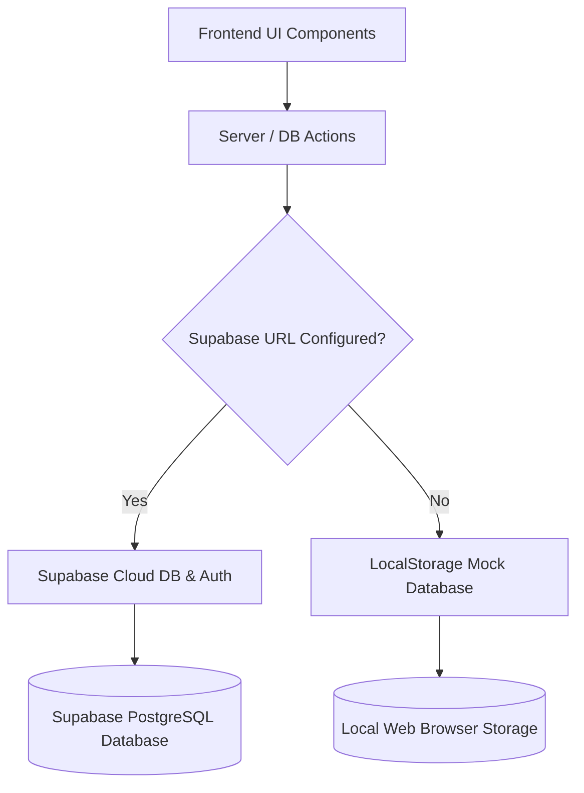

# 🛒 EliteCart — Premium E-Commerce Experience

EliteCart is a production-ready, highly responsive, and visually stunning e-commerce platform built with **React**, **Vite**, **Wouter**, and **Tailwind CSS**. It delivers a high-end customer shopping experience alongside a comprehensive administrative dashboard for order, product, and promotion management.

To guarantee immediate utility out-of-the-box, the application features a **dual database architecture**: it is fully integrated with **Supabase**, but automatically falls back to a fully mockable **LocalStorage-backed Database** if environment configurations are absent.

---

## 🌟 Core Features

### 🛍️ Client E-Commerce Portal
- **Advanced Product Catalog**: Multi-faceted real-time searching, sorting, and filtering. Customers can filter by Category, Price range, Brand, Color, Size, and Rating.
- **Dynamic Cart Drawer**: A slide-out cart overlay powered by Zustand for instant updates, enabling quick adjustments to variants, quantities, and items.
- **Checkout & Promotions**: Seamless checkout flow integrated with Stripe elements. Supports promo code validation (e.g., use `SUMMERDROP20` to get 20% off orders above $50).
- **Interactive AI Chatbot (EliteBot)**: A floating shopping assistant capable of instantly answering customer queries on tracking, refund policies, and seller configurations.
- **Reviews & Ratings**: Fully integrated review system displaying average ratings, individual reviews, and verified purchase badges.

### 📊 Admin & Seller Dashboards
- **Real-Time Analytics**: Visualized sales trend monitoring using dynamic area charts (`recharts`).
- **Product Management**: Robust forms with built-in validations to list, edit, or remove products. Fully supports multi-variant configuration (SKU, price, stock, options).
- **Order Tracker**: Interactive order pipeline tracking where admins can switch order states (Pending, Processing, Shipped, Delivered) in real-time.
- **Advertisement Scheduler**: Control hero slider advertisements, customize labels, links, images, and CTA buttons directly from the admin panel.

---

## 💻 Frontend Architecture Details

The frontend is built to be modular, fast, and visually spectacular. It mimics an App Router directory structure while executing as an ultra-fast Single Page Application (SPA).

### 1. Client Routing & Pages (`src/App.tsx` & `app/`)
Routing is powered by `wouter`, which reads from the `app/` directory and mounts pages dynamically:
- **`app/page.tsx`**: Homepage containing the Hero slider, flash deals, categories, brands, new arrivals, and testimonials.
- **`app/products/`**: Detailed grid catalog with side filter drawers and product item details (`[slug]/page.tsx`).
- **`app/admin/`**: Dashboard layout featuring analytics widgets and tables.

### 2. State Management (`lib/store/`)
Shared global client states are managed with lightweight **Zustand** stores:
- **`cartStore.ts`**: Controls cart drawer open/close toggles, local items array, additions, quantity changes, and price totals.
- **`authStore.ts`**: Retains session user context, authentication tokens, profile details, and roles (e.g., `admin`, `customer`).
- **`compareStore.ts`**: Manages product selection comparison queues.

### 3. Styling & Micro-Animations (`app/globals.css`)
- **Visual Design**: Sleek dark mode theme, fine gradients (`text-gradient-animate`), and card borders matching glassmorphic specs.
- **AOS (Animate On Scroll)**: Pre-configured scroll behaviors (`aos`) to fade, slide, and scale grids as users navigate down pages.
- **Framer Motion**: Micro-interaction transitions on dropdowns, modal windows, and buttons.

---

## 🗄️ Backend Architecture Details

The backend features a resilient decoupling pattern, enabling the app to run completely serverless locally, or fully integrated with cloud database services.



### 1. Database Operations (`actions/`)
All backend transactions are structured in TypeScript handlers under the `actions/` folder. Each action automatically checks the server-connection health before execution:
- **`products.ts`**: Handles catalog data. Implements SQL queries for filtering against Supabase database schemas, falling back to ES6 array mapping, sorting, and regex searches in `mockDb.ts` when offline.
- **`orders.ts`**: Creates orders, links purchased line items, updates variant stock levels, and appends order logs to history.
- **`admin.ts`**: Collects analytics sales data, creates monthly/daily chart data arrays, and stores slider advertisements.

### 2. Supabase SSR Integration (`lib/supabase/`)
- **`client.ts`**: Generates a browser client utilizing `@supabase/ssr` to communicate with the cloud database.
- **`server.ts`**: Server-side client generator to fetch initial session contexts safely.
- **`mockDb.ts`**: LocalStorage mock engine. Implements full CRUD mock methods for categories, products, user sessions, active coupons, and reviews, allowing offline testing without any server latency.

### 3. Payment Processing (`components/checkout/`)
- Integrated with the **Stripe JS SDK** to tokenize card inputs securely.
- Emulates successful payments and routes orders to processing in Mock Mode, or connects directly to Stripe's payment intents webhook when a client keys are supplied.

---

## 🌐 Language & Localization Support

EliteCart is architected to allow easy extension to multiple languages (Internationalization).

### 1. Current Localization Features
- **Global Settings Menu**: Access the globe icon in the Navbar header to dynamically switch currency displays between **USD ($)**, **INR (₹)**, and **EUR (€)**.
- **Formatters**: The pricing utilities automatically format numbers according to the selected currency locale.

### 2. How to Add New Languages (i18n Implementation Plan)
To implement full multilingual translation (e.g., English and Indonesian `id`), follow these steps:

1. **Create Translation Resource Files**:
   Create a JSON locale dictionary under `lib/constants/locales.ts` containing the localized strings:
   ```typescript
   export const TRANSLATIONS = {
     en: {
       welcome: "Welcome to EliteCart",
       cart: "Cart",
       checkout: "Checkout",
       shopCatalog: "Shop Catalog"
     },
     id: {
       welcome: "Selamat Datang di EliteCart",
       cart: "Keranjang",
       checkout: "Bayar",
       shopCatalog: "Belanja Katalog"
     }
   }
   ```

2. **Add a Language Context Provider**:
   Create a context hook `lib/hooks/useLanguage.tsx` to toggle between languages and expose a translation helper function `t`:
   ```typescript
   import { createContext, useContext, useState } from 'react'
   import { TRANSLATIONS } from '../constants/locales'

   const LanguageContext = createContext({
     lang: 'en',
     setLang: (l: string) => {},
     t: (key: keyof typeof TRANSLATIONS.en) => ''
   })

   export function LanguageProvider({ children }: { children: React.ReactNode }) {
     const [lang, setLang] = useState('en')
     const t = (key: string) => TRANSLATIONS[lang][key] || TRANSLATIONS.en[key] || key

     return (
       <LanguageContext.Provider value={{ lang, setLang, t }}>
         {children}
       </LanguageContext.Provider>
     )
   }

   export const useLanguage = () => useContext(LanguageContext)
   ```

3. **Integrate into the Interface**:
   Wrap the application inside `src/App.tsx` with the `<LanguageProvider>`, and use the `t` hook in components:
   ```tsx
   import { useLanguage } from '@/lib/hooks/useLanguage'
   
   const { t } = useLanguage()
   return <h1>{t('welcome')}</h1>
   ```

---

## 🛠️ Technology Stack Breakdown

| Category | Technology | Description |
| :--- | :--- | :--- |
| **Frontend Core** | React 18, TypeScript | Robust component architecture and type safety |
| **Bundling & Speed** | Vite 8 | Near-instant hot module reloading (HMR) and fast builds |
| **Routing** | Wouter | Ultra-lightweight React routing engine |
| **Styling** | Tailwind CSS, Lucide Icons | Utility-first styling with modern responsive grids |
| **State Management**| Zustand | Lightweight, high-performance client state stores |
| **Visualizations** | Recharts | Modern SVG area charts for seller analytics |
| **Animations** | AOS, Framer Motion | Fluid on-scroll entries and interactive micro-animations |
| **Database & Auth** | Supabase SSR | Server & client integration for full-stack control |
| **Payments** | Stripe SDK | Fully secure payments interface |

---

## 📁 Directory Structure

```filepath
├── actions/                   # Server/DB Action Handlers
│   ├── addresses.ts           # Customer shipping addresses
│   ├── admin.ts               # Dashboard stats, orders, ads controls
│   ├── coupons.ts             # Coupon validation logic
│   ├── orders.ts              # Checkout and orders retrieval
│   ├── products.ts            # Querying, filtering, and catalog actions
│   ├── profile.ts             # User profiles management
│   └── reviews.ts             # Product reviews and submissions
├── app/                       # Application Pages (Next.js layout routing style)
│   ├── admin/                 # Admin console, advertisements, and product editors
│   ├── account/               # Customer order history and wishlist
│   ├── checkout/              # Stripe-integrated checkout & success screens
│   ├── products/              # Catalog list and product detail page
│   ├── category/              # Specific category grids
│   ├── login/ & register/     # Authentication screens
│   ├── globals.css            # Base styles and Tailwind configuration
│   └── page.tsx               # Homepage layout with promotional grids
├── components/                # Reusable UI & Logical Components
│   ├── admin/                 # Analytics charts and administrative forms
│   ├── checkout/              # Secure checkout form components
│   ├── layout/                # Navbar, Footer, and Cart Drawer
│   ├── products/              # Related items, reviews, filters, and cards
│   ├── shared/                # Theme controls, loading states, and chatbot
│   └── ui/                    # Base visual primitives (Buttons, Inputs, Cards)
├── lib/                       # Utilities and Configurations
│   ├── store/                 # Zustand state stores (auth, cart, compare)
│   ├── supabase/              # Supabase clients and LocalStorage mock database
│   └── utils.ts               # CSS class merger tool
├── src/                       # Client Bootstrapper
│   ├── App.tsx                # Main Router (Wouter Switch)
│   └── main.tsx               # React DOM entry point
├── index.html                 # Main HTML entry with Inter Font
├── vite.config.ts             # Vite configuration with folder aliases
└── package.json               # Dependencies and scripts
```

---

## 🚀 Getting Started

### 1. Prerequisites
Ensure you have **Node.js** (v18 or higher) and **npm** installed.

### 2. Clone and Install
Clone this repository to your local machine, then install the dependencies:
```bash
npm install
```

### 3. Setup Environment Variables (Optional)
If you want to connect to a production Supabase instance, create a `.env.local` file in the root directory:
```env
NEXT_PUBLIC_SUPABASE_URL=your-supabase-url
NEXT_PUBLIC_SUPABASE_ANON_KEY=your-supabase-anon-key
```
*Note: If these variables are omitted, EliteCart will seamlessly fall back to LocalStorage mode, allowing full functionality of all cart, checkout, admin, and profile features locally.*

### 4. Run the Development Server
Run the development command:
```bash
npm run dev
```
Open [http://localhost:5173](http://localhost:5173) in your browser to inspect the application.

### 5. Build for Production
To compile and optimize the app for production deployment, run:
```bash
npm run build
```
This builds the application into the `/dist` directory. Use `npm run start` (or `vite preview`) to preview the production build locally.

---

## 🔑 Demo Account
When testing in **LocalStorage Mock DB Mode**, a pre-configured admin profile is ready for use.
- Navigate to the **Login Page**
- Use the credentials loaded in mock data to access the **Admin Console** or test orders
- Code `SUMMERDROP20` can be applied on checkout for discount testing.
